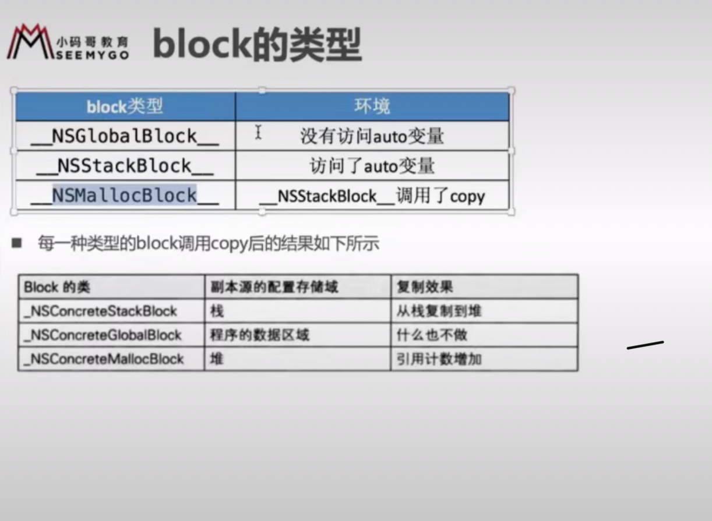

# interview

## Object - C

### NSObjcet

```clang -rewrite-objc main.m -o main.cpp```

- **OC对象的本质**
  - 底层实现是一个结构体
  - class 的isa 指针， class指向结构体的指针

- OC的对象分为哪些
  - instance实例对象
  - 类class对象
  - 元类meta-class对象

- OC 的类信息存放在哪里？
  - 对象方法、属性、成员变量、协议信息存放在class对象中
  - 类方法 存在meta -class 元类对象中
  - 成员变量的具体值，存放在instance对象

### KVO

- kvo的本质是什么？*
  - 利用runtimeAPI动态生成一个子类，并且让instance对象的isa指针指向这个全新的子类（NSKVONotifying_ClassName)
  - 当修改instance对象属性时，会调动Fundation框架中的_NSSet**valueAndNotify函数
    - willChangeValueForKey:
    - 父类原来的setter
    - didchangeValueForkey
      - 内部会触发（Oberser)的监听器方法（observeValueForKeyPath）
- 如何手动触发KVO
  - 调用监听对象的willChangevalueForkey 和 didChangeValueForKey

### KVC

```objc
  [self.p1 setValue:@20 forKey:@"age"];
```

- kvc 实现原理
  - setKey 或者 set_key
    - 找不查看accessInstanceVariablesDirectly的返回值
      - 如果为NO，包抛出NSUnknownkeyException
      - YES, key,_isKey,key,_isKey
        - 找不到会抛accessInstanceVariablesDirectly的返回值
  - 传递参数

- 通过kvc修改，会触发kvo吗？ 会触发
  - 内部也会调用willChangeVlaueForkey
  - 内部也会调用didChangeVlaueForkey
  
### Category

- Category的使用场合
- category结构
  
```objc
// 编译出来的结果
struct _category_t {
    const char *name;   // 类名
    const struct objc_method_list *instance_methods; // 对象方法列表
    const struct objc_method_list *class_methods; // 类方法聊表
    const struct _protocol_list_t *protocols; // 协议列表
    const struct _prop_list_t *properties;  // 属性列表
};
```

- Category的实现原理
  - 通过runtime加载某个类所有的category数据
  - 把所有的category的方法、属性、协议数据 合并到一个大的数组中
  - 后面参与便于的category数据会在数组的前面
  - 将合并后的分类数据（方法，属性，协议）插入到类原来的数据前面
- Category 和 Class Extension的区别是什么？
  - Class Extension 编译的时候合并到类对象中
  - Category是运行的时候 方法合并到类对象中

### load initialize

- load 的调用时机？
  - load方法会在runtime加载类、分类时调用
  - 每个类、分类的方法都会调用一次，且类会先于分类调用，父类优先于子类
  - 不同类、分类之间 看编译顺序
- load 方法都会调用原因？
  - load 通过函数指针，拿到函数直接去分开调用的，不是通过objc_msgSend去调用
- initialize 调用时机？
  - 会在类第一次接受消息的时候，只会触发一次
    - alloc、类方法等
    - 会先调用父类initialize，在调用本身的initialize
- load initialize 的区别
  - 调用方式：
    - load是通过函数地址直接调用
    - initialize是通过objc_msgSend调用
  - 调用时刻
    - load是runtime加载类、分类时候调用（只会调用一次）
    - initialize是类第一次接收到消息的时候调用，每一个类只会initialize一次（父类的initialize可能会调用多次）

- load 调用顺序
  - 先调用类的load
  - 先编译的类，优先调用
  - 调用子类的load之前，会调用父类的load
- initialize 调用顺序
  - 如果有父类，先调用父类，在调用子类
  - 如果有分类，只会调用分类initialize
  - 如果有多个分类，最后编译的分类被调用，可在compile source 查看编译顺序
  
- Category能否添加成员变量？如果可以，如何给category添加成员变量？
  - 不能直接给category添加成员变量，但是可以间接实现category添加
  
### block


- block 内部结构？
  - struct _block_impl impl; // impl结构体变量
    - void *isa;  // isa 指针
    - void *FuncPtr; // 指向了将来执行的函数地址
  - struct __block_desc_0* Desc; // 描述信息
    - size_t reserved;// 暂时没用
    - size_t Block_size;
  - variables（auto、static）

- 什么是block，block的本质？
  
```本质上是一个oc对象，内部也有isa的指针；```
```block是封装了函数调用以及函数调用环境的oc对象，所谓环境就是捕获的变量、函数的调用地址```

- __block的作用是什么？有什么使用注意？
  - 解决内部无法修改auto 变量的问题
    - 它会将auto 变量内部包装成对象
  - 注意：
- 为什么用copy？使用block有哪些使用注意？
  - 没有进行copy就不会在堆上
  - 注意循环引用问题
- 用strong修饰block
  - arc没有区别，都会copy在堆上
  - mrc strong 不会copy堆上, copy修饰符 会

- 内存区域
  - 程序区域
  - 数据区域
  - 堆
  - 栈

- block类型
  - globalBlock   数据段区
  - stackBlock    栈区
  - mallocBlock   堆区

#### block copy



```ARC环境下，编译器会根据情况自动将栈上的block复制到堆上```

- block作为函数的返回值

```objc
// arc 环境
  #import <Foundation/Foundation.h>
  typedef void(^MJBlock)(void);
  MJBlock myBlock() {
      int a = 10;
      return ^{
          int a1 = a;
          NSLog(@"---");
      };
  }

  int main(int argc, const char * argv[]) {
      @autoreleasepool {
          MJBlock block = myBlock();
          NSLog(@"block:%@",[block class]); // __NSMallocBlock__
      }
      return 0;
}
```

- 如果block被某个强指针指着

```objc
      int age = 10;
      MJBlock block1 = ^{
          NSLog(@"block1:%d",age);
      };
      NSLog(@"block:%@",[block1 class]); // __NSMallocBlock__
```

- block作为Coacoa API中方法名中含有using Block的方法参数时

```objc
   NSArray *array = [NSArray array];
    [array enumerateObjectsUsingBlock:^(id  _Nonnull obj, NSUInteger idx, BOOL * _Nonnull stop) {}];

    GCD的block
```

#### 对象类型额auto变量

- 当block内部访问了对象类型的auto变量
  - 如果block在栈上stack，将不会对auto变量强引用
  - 如果block被拷贝到堆上
    - 会调用block内部的copy函数
    - copy函数内部会调用_block_object_assign函数
    - _block_object_assign函数会根据auto变量的修饰符（__strong、__weak、__unsafe_unretained）作出相应的操作，类型retaion（形成强弱引用）
  - 如果block从堆上移除
    - 会调用dispose函数，该函数会自动释放引用auto变量，类似release

#### __block

```内部访问外部的auto变量```

#### 循环引用
```两个强引用，互相引用```

- __weak
- __unsafe_unretained
- __block 也能解决，比较麻烦

### runtime

```OBJect - C 动态性语言```

#### 消息机制

### 08-多线程

- 常见多线程方案


- GCD的队列可以分为2大类型
  - 并发队列
    - 可以让多个任务并发（同时）执行（自动开启多个线程）
    - 并发功能只有在异步函数下才有效
  - 串行队列
    - 让任务一个接着一个地执行（一个任务执行完成后，再执行下一个任务）
- 各种队列的执行效果


- 死锁
```使用sync往当前队串行队列（主队列也是串行）添加任务，因为sync会立马执行```

### time定时器

### tabview 卡顿

### 离屏渲染

### mvvm（rac） mvp

### 直播

### app国际化

